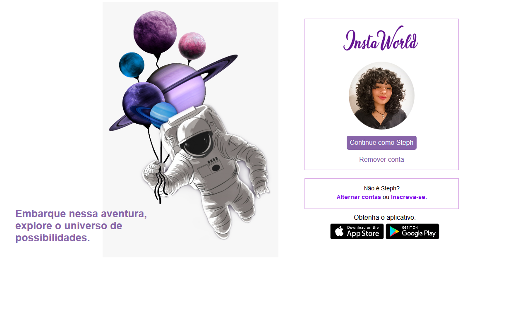
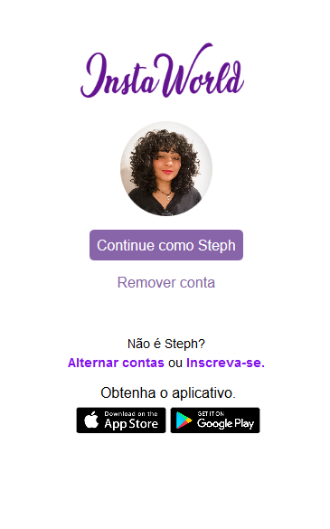
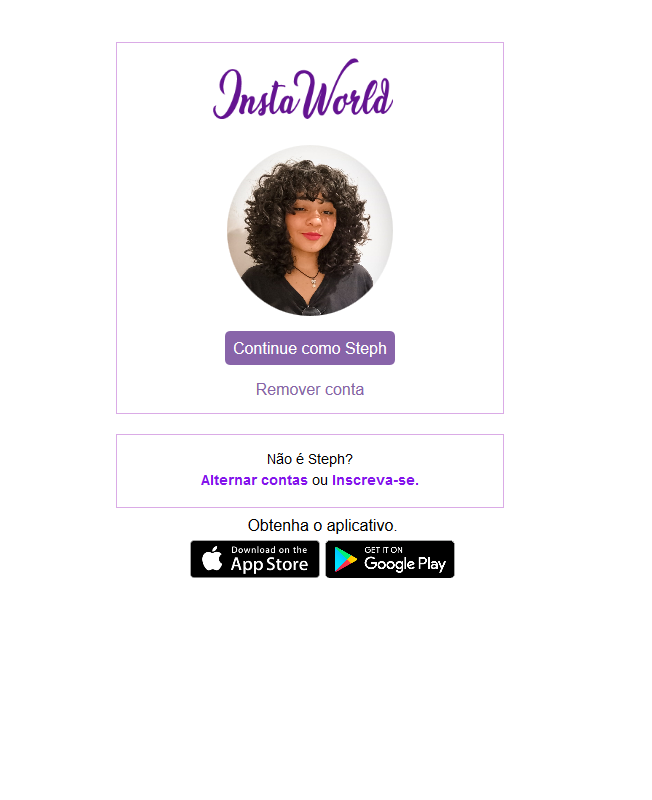
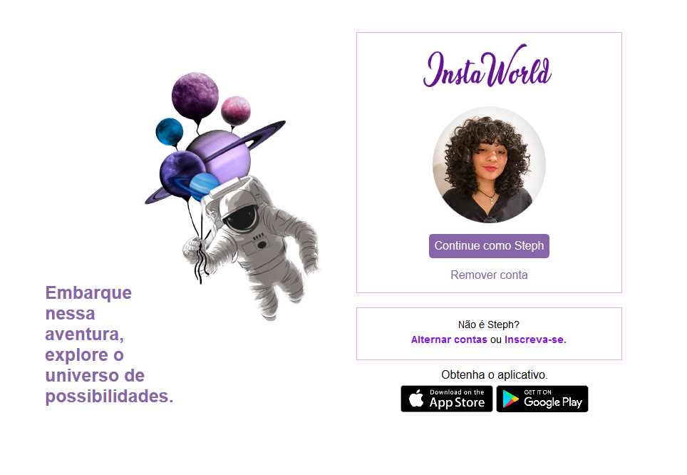

# Recriando a interface do Instagram

### Objetivo

Este projeto (intitulado por mim mesma de "InstaWorld" haha) foi criado com os conhecimentos adquiridos na trilha de cursos do <a href= "https://web.dio.me/track/9fb3f492-ea99-4055-82cb-c364f18706ecBootcamp">Bootcamp HTML Web Developer</a>, proporcionado pela plataforma <a href="https://www.dio.me/sign-in">Digital Innovation One</a>, no qual foi utilizado de Flexbox CSS3 para tornar o site responsivo e para se tornar semelhante a interface do Instagram.

### Tecnologias utilizadas 

:white_circle: &nbsp;    :white_circle: &nbsp;    :white_circle: &nbsp;    :white_circle: &nbsp;  

## Conheça a interface do &nbsp; &nbsp; &nbsp; &nbsp; &nbsp; &nbsp; &nbsp; &nbsp;

### Versão Desktop

### Versão Mobile

### Versão Tablet

Feito com ❤️ por    
 
### Stephany Lopes

## 

	

 

