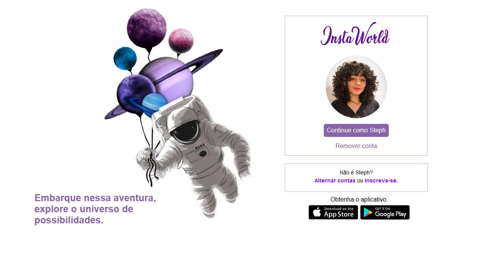

# Recriando a interface do Instagram

### Objetivo

Este projeto (intitulado por mim mesma de "InstaWorld" haha) foi criado com os conhecimentos adquiridos na trilha de cursos do <a href= "https://web.dio.me/track/9fb3f492-ea99-4055-82cb-c364f18706ecBootcamp">Bootcampa HTML Web Developer</a>, proporcionado pela plataforma <a href="https://www.dio.me/sign-in">Digital Innovation One</a>, no qual foi utilizado de Flexbox CSS3 para tornar o site responsivo e para se tornar semelhante a interface do Instagram.

### Tecnologias utilizadas 

:black_circle: &nbsp;&nbsp; :black_circle: &nbsp; &nbsp;&nbsp; :black_circle:&nbsp;   &nbsp; :black_circle: &nbsp; 

###Conheça a interface do       

[x] Versão Desktop

[ x ] Versão Mobile

[ x ] Versão Tablet

Feito com ❤️ por    
 
### Stephany Lopes

## 

	
​	
 

​	

